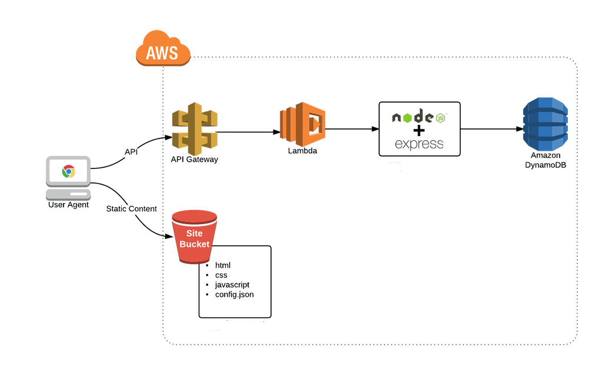

# Serverless workweek microservice
Use AWS resources to create serverless micro-service and host static web pages to build Single Page Application, SPA 

# Migration from existing EC2 based micro-service  

This repository take existing docker-base micro-services running on AWS EC2 instance and migrate to serverless micro-service.  Original implementation use MEAN stack. Serverless approach will use AWS API Gateway, Lambda, and DynamoDB. The SPA AngularJS app work as micro-service consumer is hosted on AWS S3 and can be viewed [here](http://workweek.s3-website-us-west-2.amazonaws.com/). To help deploy serverless microservices to AWS easily, [claudia](https://github.com/claudiajs/claudia) is used.

## Architechture Diagram



## Prerequisites

Create a workweek table in DynamoDB, with a `string` primary key called `ww_date`. You can do that from the DynamoDB web console.


This project includes an IAM access policy that will grant the lambda function access to all your DynamoDB tables, to make it easier to get started. If you wish, you can edit the [policies/access-dynamodb.json](policies/access-dynamodb.json) file and restrict the access to your new table only.

## Data Migration from MongoDB to DynamoDB
You have to migrate data from MongoDB to DynamoDB first.  data-migration/README.md have the instruction.

## Get started

To set this up, first [set up the credentials](https://github.com/claudiajs/claudia/blob/master/getting_started.md#configuring-access-credentials), then: 

1. run `npm install` to grab the dependencies
2. run `npm run create` to create the lambda project under the default name on AWS. 
3. configure the API gateway to access your DynamoDB table, by setting up the `tableName` stage variable to point to your table in the `latest` API gateway stage. You can do that from the command line (replace `API_ID` with the ID of your API, from `claudia.json`, and `TABLE_NAME` with the name of the table (`workweek`):

  ```bash 
  aws apigateway create-deployment --rest-api-id API_ID \
    --stage-name latest --variables tableName=TABLE_NAME
  ```
For subsequent updates, use the `claudia update` command.

## The API


* `GET` to `/workweek/{ww_date}` - returns workweek with work week date `{ww_date}`

format of `{ww_date}`: yyyy-mm-dd


## Testing

You can test the API by using `curl` (or using a fancier client like [Postman](https://www.getpostman.com/)). Below are some examples with `curl`. 

Replace `[API ID]` with the ID of your API (see the generated `claudia.json` file, something like: `qxgwaa3n6b`), and `[REGION]` with your AWS Region (eg `us-west-2`) in the examples below.


### Get workweek

```bash
curl -H "Content-Type: application/json" https://[API ID].execute-api.[REGION].amazonaws.com/latest/workweek/2015-02-01
```


## How it works


The table name, stored in the Lambda stage variables, is passed with each request in the `request.env` key-value map. Check out [index.js](index.js) to see how it is used, in the `getTableName` helper function.

Claudia automatically creates a stage called `latest` if no specific version is provided. You can create additional stages and automatically grant execution privileges by using `claudia set-version`. For example, the following command will create a `development` stage:

```bash
claudia set-version --version development
```

You can then add the `tableName` stage variable for `development` to point to a specific table. To invoke that API version, replace the word `latest` with `development` in the URL examples above.
